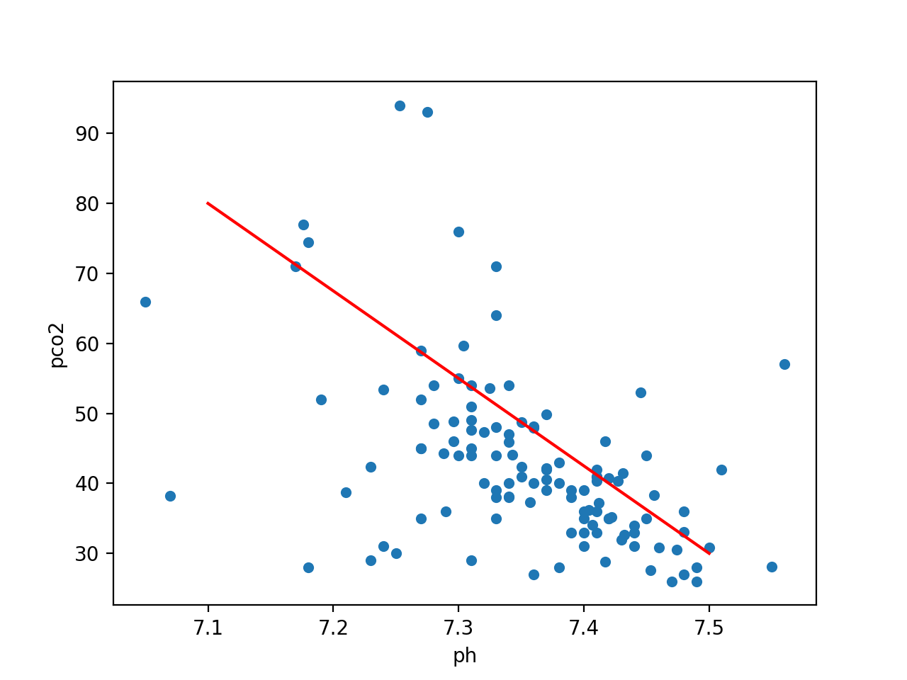
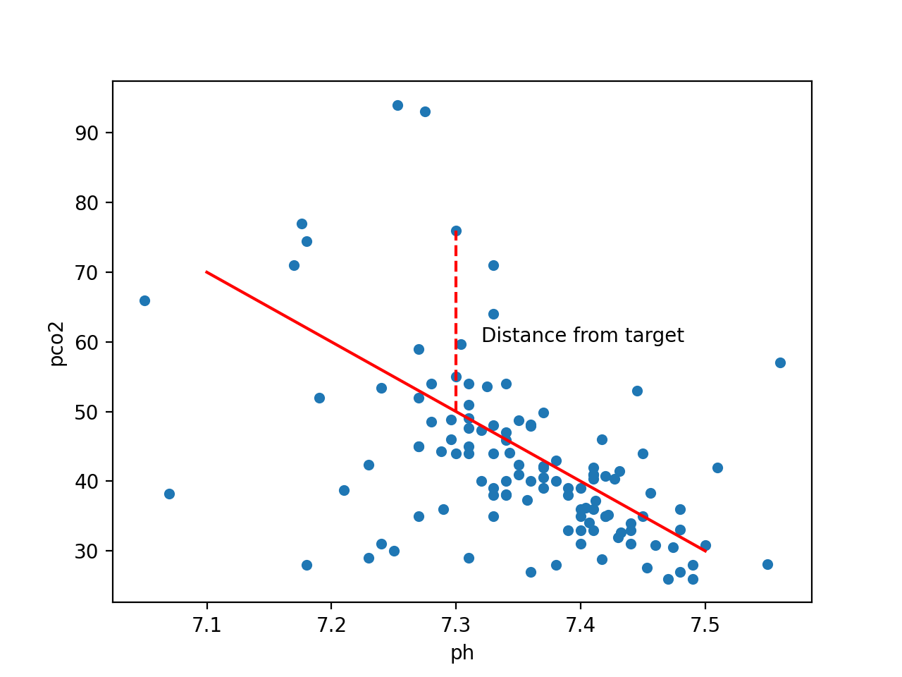



## How do machines learn?

How do humans learn? Typically we are given examples and we learn rules through trial and error. Machines aren't that different! In the context of machine learning, we talk about how a model "fits" to the data.

In prediction tasks we seek to learn a relationship between observations in our data (`x`) and known target values (`y`). We fit our model to our data to learn a set of parameters for making predictions in a process known as "training".

## Quantifying error

The key to learning is quantifying error, so that we can distinguish between good and bad, right and wrong. Let's explore how a model can learn a relationship using data collected from patients admitted to intensive care units across the United States. 

In critical care patients, arterial blood gases (ABGs) are regularly taken to monitor the acid-base balance of the blood. Two key components of a blood gas test are: pH, a measure of acidity of the blood; and pCO2, the partial pressure of carbon dioxide in the blood.

Overly acidic or alkali blood can indicate serious issues with the body's metabolic and respiratory systems. Acid-base disturbance may indicate issues such as lack of oxygen perfusion to tissues due to infection, respiratory disease, and liver failure. 


```python
# import libraries
import os
import pandas as pd
from matplotlib import pyplot as plt

# load the data
cohort = pd.read_csv('./data/eicu_cohort_ph.csv')

# plot the data
cohort.plot(x='ph', y='pco2', kind='scatter')
ax.set_title('pH vs pCO2');
```

{: width="600px"}

As a starting point, we'll begin by approximating a line of best fit by placing a line a little haphazardly onto the data. Not quite the best line of fit, but not too far off.

```python
# plot the data and approx line of fit
ax = cohort.plot(x='ph', y='pco2', kind='scatter')
ax.plot([7.1, 7.5], [60, 32], color='red')
ax.set_title('pH vs pCO2, with line');
```

{: width="600px"}

## Mean squared error 

To fit the best line to the data, we need to define a function that quantifies goodness of fit. This is our loss function (you will hear "objective function", "error function", and "cost function" used in a similar way).

Mean squared error is one example of a loss function. We measure the distance between each known target value ($$y$$) and the position of our line, and then we take the square.

```python
# plot the data and approx line of fit
ax = cohort.plot(x='ph', y='pco2', kind='scatter')
ax.plot([7.1, 7.5], [70, 30], color='red')

# plot a vertical line
ax.vlines(x=7.3, ymin=50, ymax=76.0, color='red', linestyle='dashed')
ax.text(x=7.32, y=60, s='Distance from target')
ax.set_title('pH vs pCO2, with line and distance');
```

{: width="600px"}

The further away from the data points our line gets, the bigger the error. Our best model is the one with the smallest error. Mathematically, we can define the mean squared error ($$mse$$) as:

$$
mse = \frac{1}{n}\sum_{i=1}^{n}(y_{i} - \hat{y}_{i})^{2}
$$

Where, $$y_{i}$$ is the actual value, $$\hat{y}_{i}$$ is the predicted value, and n is the number of observations. 

## Linear regression

Linear regression models can be described by the following formula, where $$\beta_0$$ is the y-axis intercept, $$\beta_1$$ is the slope, and x is the explanatory variable.

$$
f(x) = \beta_0 + \beta_1 \times x_1
$$

Starting with some guesswork, let's pick values for $$\beta_0$$ and $$\beta_1$$ and calculate the error. 

```python
# `mean_squared_error` computes MSE from two lists (y_true and y_hat)
from sklearn.metrics import mean_squared_error

# Define our model
def model(b0, b1, X):
    """
    Linear regression model: f(x) = bo + b1 * x. Takes array of x-values and
    outputs corresponding y-values.
    """
    return b0 + (b1 * X)

# Select coefficients
b0 = 400
b1 = -80

# Get x, y_true, and y_pred
x = cohort.ph.values
y_true = cohort.pco2.values
y_pred = model(b0, b1, x)

# Compute MSE
print(f'MSE of model: {mean_squared_error(y_true, y_pred)}')
```

How did we do? To improve our model, we need to find better values for $$\beta_0$$ and $$\beta_1$$. 

## Minimising the error

Our goal is to find the model with the minimum mean squared error:

$$
argmin\frac{1}{n}\sum_{i=1}^{n}(y_{i} - \hat{y}_{i})^{2}
$$

We need to find the optimal values of $$\beta_0$$ and $$\beta_1$$ to satisfy the formula. Let's plot the mean squared error across a matrix of different values of our two parameters, $$\beta_0$$ and $$\beta_1$$, to get a better idea about what the optimal model might be.

[TODO: clean and perhaps vectorize and normalize.]

```python
import numpy as np
# library for 3d surface plot
from mpl_toolkits import mplot3d

# range of b0 and b1 values to iterate over
b0_vec = np.linspace(540, 560, num=50)
b1_vec = np.linspace(-60, -80, num=50)
xx,yy = np.meshgrid(b0_vec, b1_vec)

# create a matrix of our b0 and b1 vectors
def loss(b0, b1):
    """
    b0 and b1 can be lists.
    """
    y_true = cohort.pco2.values
    y_pred = model(b0, b1, cohort.ph.values)
    # Compute MSE
    return mean_squared_error(y_true, y_pred)

# compute MSE for each (b0, b1) point on grid
zz = np.empty([len(b0_vec),len(b1_vec)])
for n,x in enumerate(b0_vec):
    for m,y in enumerate(b1_vec):
        zz[n,m] = loss(x, y)

# plot
ax = plt.axes(projection='3d')
ax.set_xlabel('Intercept (b0)')
ax.set_ylabel('Slope (b1)')
ax.set_zlabel('Loss', rotation="vertical")
ax.plot_surface(xx, yy, zz, rstride=1, cstride=1, cmap='plasma')
ax.set_title('Model error over different values of b0 and b1');
plt.show()
```

{: width="600px"}

Each (x,y) point represents a fitted line. The z-axis show the corresponding error value. Our goal is to find the values for $$\beta_0$$ and $$\beta_1$$ that correspond to the minimum loss. In the next section, we'll look at how we can search this space to find our optimal parameters for $$\beta_0$$ and $$\beta_1$$ .

