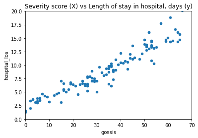
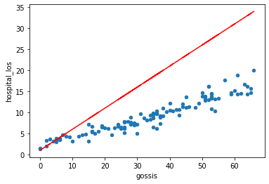
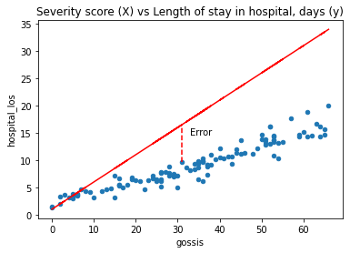

## How do machines learn?

How do humans learn? Typically we are given examples and we learn rules through trial and error. Machines aren't that different! In the context of machine learning, we talk about how a model "fits" to the data.

In prediction tasks we seek to learn a relationship between observations or "features" (`X`) and known target values (`y`). We fit our model to data to learn a set of parameters for making predictions in a process known as "training".

## Predicting length of hospital stay

Let's say that our goal is to predict how long patients will stay in hospital, given an indicator of their severity of illness. We will use some pre-prepared synthetic data that a Global Open Source Severity of Illness Score ("GOSSIS") calculated on patient admission, along with length of hospital stay in days. 

```python
# import libraries
import os
import numpy as np
import pandas as pd
from matplotlib import pyplot as plt

# load the data
cohort = pd.read_csv('./data/example_los.csv')

# Display the first 5 rows of the data
cohort.head()
```

GOSSIS score is our feature (X) and number of days in hospital is our target (y). In most tasks, we have multiple features rather than a single feature. Let's take a look at the data by plotting our feature against the target.

```python
# plot the data
ax = cohort.plot(x='gossis', y='hospital_los', kind='scatter')
ax.set_xlim(0, 70)
ax.set_ylim(0, 20)
ax.set_title('Severity score (X) vs Length of stay in hospital, days (y)');
```

{: width="600px"}

Our goal is to predict how long patients will stay in hospital for a given severity score. We already have a set of training data with input features (X) and known prediction targets (y). This is the perfect job for supervised machine learning. We say "supervised" because our training data is able to learn from examples with known targets or labels. 

## Linear regression

We will use a linear regression, a type of model borrowed from statistics that has all of the hallmarks of machine learning (so let's call it a machine learning model!). Given that we are trying to think in terms of machine learning, we'll use a notation that may differ slightly from the one in your statistics classes:

$$
\hat{y} = wX + b
$$

Our prediction target (length of stay) is denoted by $\hat{y}$ (pronounced "y hat") and our explanatory variable (or "feature") is denoted by $X$. $w$ is weight and $b$ is bias. These are the parameters of the model that we would like to learn from the training data. 

While our model has only a single feature ("severity score"), in most cases we would be working with multiple features. Each feature adds a dimension to our feature space. With a single feature and a single outcome, we can model the relationship in two dimensions. With two features, we move into 3 dimensions, and so on. 

When we add a feature, we also need to add a new weight as a modifier for that feature. As a general rule, adding more features to our model improves predictive performance (though, as we will learn later, too many features can cause a problem known as "overfitting"). 

Practically speaking, the components of a model with 3 features and 5 training examples look like this: 

$$
X =
\begin{bmatrix}
  x_{1}^1 & x_{2}^1 & x_{3}^1 \\ 
  x_{1}^2 & x_{2}^2 & x_{3}^2 \\
  x_{1}^3 & x_{2}^3 & x_{3}^3 \\
  x_{1}^4 & x_{2}^4 & x_{3}^4 \\
  x_{1}^5 & x_{2}^5 & x_{3}^5 \\
\end{bmatrix}

weights =
\begin{bmatrix}
  w_{1} \\ 
  w_{2} \\
  w_{3} \\
\end{bmatrix}

bias =
\begin{bmatrix}
  b_{1} \\ 
  b_{2} \\
  b_{3} \\
\end{bmatrix}
$$

In code, we can write our model as follows:

```python
def model(weight, X, bias):
    """
    Linear regression model: y_hat = wX + b. Takes array of x-values and
    outputs corresponding y-values.
    """
    return np.dot(weight, X) + bias
```

> ## Exercise
> A) What is typically represented by $$\hat{y}$$ in a model?  
> B) If a model is "high-dimensional", what does this say about the number of predictor variables?   
> C) What is the risk of including too many predictor variables in a model?  
> 
> > ## Solution
> > A) $$\hat{y}$$ (pronounced y hat!) represents the predicted value.    
> > B) A high-dimensional model includes a large number of predictor variables.  
> > C) Including a high-number of predictor variables may increase the risk of overfitting.  
> {: .solution}
{: .challenge}

## Finding the best model

To allow us to make the best predictions, we would like to find a weight and bias that give us $\hat{y}$ values that are as close as possible to the true $y$ values in the training data. We'll start by guesstimating values for these two parameters.

```python
# Select coefficients
w = 0.5
b = 0

# Get x, y_true, and y_pred
x = cohort.gossis.values
y_true = cohort.hospital_los.values
y_hat = model(w, x, b)

ax = cohort.plot(x='gossis', y='hospital_los', kind='scatter')
ax.plot(x, y_hat, color='red');
```

{: width="600px"}

How did we do?

> ## Exercise
> A) Have a play around with the model coefficients. Can you find a better fit?   
> B) How would you describe your approach for finding the optimal values?
> 
> > ## Solution
> > A) Slightly increasing the bias (y-axis intercept) and reducing the value of weight (gradient) should lead to a better fitted model.   
> > B) Most likely you used some form of trial and error!
> {: .solution}
{: .challenge}

## Loss functions

Fitting the line of best fit means knowing what we mean by "best". We need to have some way of quantifying the difference between a "good" model (capable of making useful predictions) vs a "bad" model (not capable of making useful predictions). 

We typically define a function that quantifies goodness of fit.  This is our loss function (you will hear "objective function", "error function", and "cost function" used in a similar way). 

Mean squared error is one example of a loss function. We measure the distance between each known target value ($y$) and the position of our line, and then we take the square.

```python
# plot the data
ax = cohort.plot(x='gossis', y='hospital_los', kind='scatter')

# plot approx line of best fit
ax.plot(x, y_hat, color='red');

# plot a vertical line
idx = 50
ax.vlines(x=x[idx], ymin=y_true[idx], ymax=y_hat[idx],
          color='red', linestyle='dashed')
ax.text(x=x[idx]+2, y=y_true[idx]+5, s='Error')
ax.set_title('Severity score (X) vs Length of stay in hospital, days (y)')
```

{: width="600px"}

The further away from the data points our line gets, the bigger the error. Our best model is the one with the smallest error. Mathematically, we can define the mean squared error as:

$$
mse = \frac{1}{n}\sum_{i=1}^{n}(y_{i} - \hat{y}_{i})^{2}
$$

$mse$ is the Mean Squared Error. $y_{i}$ is the actual value and $$\hat{y}_{i}$$ is the predicted value. $\sum_{}$ is notation to indicate that we are taking the sum of the difference. $n$ is the total number of observations, so $$\frac{1}{n}$$ indicates that we are taking the mean.

We could implement this in our code as follows:

```python
def loss(y, y_hat):
    """
    Loss function (mean squared error)
    """
    return np.mean((y - y_hat)**2)
```

## Minimising the error

Our goal is to find the "best" model. We have defined best as being the model with weights and bias that give us the smallest mean squared error. We can write this as:

$$
argmin\frac{1}{n}\sum_{i=1}^{n}(y_{i} - \hat{y}_{i})^{2}
$$

Let's stop and look at what this loss function means. We'll plot the squared error for a range of values to demonstrate how loss scales as the difference between $y$ and $$\hat{y}$$ increases.

```python
x = np.arange(-50, 50, 0.05)
y = np.square(x)

plt.plot(x, y)
plt.xlabel('Difference between y and y_hat')
plt.ylabel('Loss (squared error)')
```

{: width="600px"}

As we can see, our loss rapidly increases as predictions ($$\hat{y}$$) move away from the true values ($y$). The result is that outliers have a strong influence on our model fit. 

## Optimisation

In machine learning, there is typically a training step where an algorithm is used to find the optimal set of model parameters (i.e. those parameters that give the minimum possible error). This is the essence of machine learning!

There are many approaches to optimisation. [Gradient descent](https://en.wikipedia.org/wiki/Gradient_descent) is a popular approach. In gradient descent we take steps in the opposite direction of the gradient of a function, seeking the lowest point (i.e. the lowest error).

In supervised learning, we seek an optimal set of parameters that minimise the error for our known prediction targets. In unsupervised learning, we seek an optimal set of clusters or separation of data points. 

> ## Exercise
> A) What does a loss function quantify?  
> B) What is an example of a loss function?   
> C) What are some other names used for loss functions?  
> D) What is happening when a model is trained?  
> 
> > ## Solution
> > A) A loss function quantifies the goodness of fit of a model (i.e. how closely its predictions match the known targets).  
> > B) One example of a loss function is mean squared error (M.S.E.).  
> > C) Objective function, error function, and cost function.  
> > D) When a model is trained, we are attempting to find the optimal model parameters in process known as "optimisation".  
> {: .solution}
{: .challenge}

Now that we've touched on how machines learn, we'll tackle the problem of predicting the outcome of patients admitted to intensive care units in hospitals across the United States.


