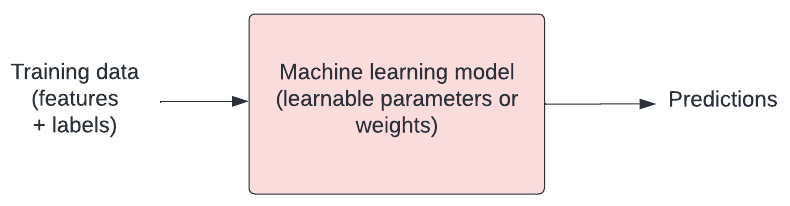
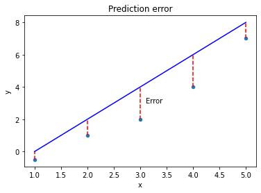
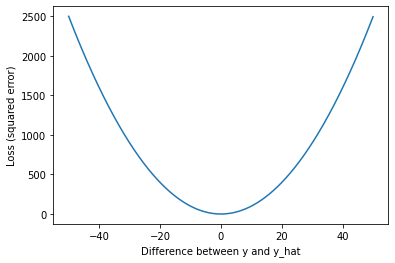
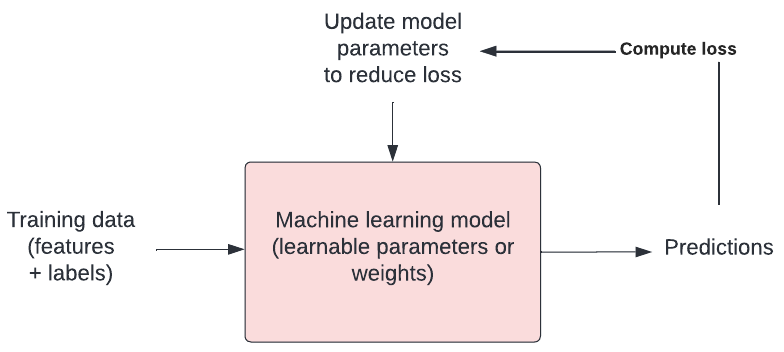

## How do machines learn?

How do humans learn? Typically we are given examples and we learn rules through trial and error. Machines aren't that different! In the context of machine learning, we talk about how a model "fits" to the data.

Our model has a number of tweakable parameters. We need to find the optimal values for those parameters such that our model outputs the "best" predictions for a set of input variables.

{: width="600px"}

## Loss functions

Finding the best model means defining "best". We need to have some way of quantifying the difference between a "good" model (capable of making useful predictions) vs a "bad" model (not capable of making useful predictions). 

Loss functions are crucial for doing this. They allow us to quantify how closely our predictions fit to the known target values.  You will hear "objective function", "error function", and "cost function" used in a similar way. 

Mean squared error is a common example of a loss function, often used for linear regression. For each prediction, we measure the distance between the known target value ($y$) and our prediction ($y_{hat}$), and then we take the square.

```python
import pandas as pd

# Create sample labelled data
data = {'x': [1, 2, 3, 4, 5], 'y': [-0.5, 1, 2, 4, 7]}
df = pd.DataFrame(data)

# Add predictions
df['y_hat'] = [0, 2, 4, 6, 8]

# plot the data
ax = df.plot(x='x', y='y', kind='scatter')

# plot approx line of best fit
ax.plot(df['x'], df['y_hat'], color='blue');

# plot error
ax.vlines(x=df['x'], ymin=df['y'], ymax=df['y_hat'], color='red', linestyle='dashed')
ax.text(x=3.1, y=3, s='Error')
ax.set_title('Prediction error')
```

{: width="600px"}

The further away from the data points our line gets, the bigger the error. Our best model is the one with the smallest error. Mathematically, we can define the mean squared error as:

$$
mse = \frac{1}{n}\sum_{i=1}^{n}(y_{i} - \hat{y}_{i})^{2}
$$

$mse$ is the Mean Squared Error. $y_{i}$ is the actual value and $$\hat{y}_{i}$$ is the predicted value. $\sum_{}$ is notation to indicate that we are taking the sum of the difference. $n$ is the total number of observations, so $$\frac{1}{n}$$ indicates that we are taking the mean.

We could implement this in our code as follows:

```python
import numpy as np

def loss(y, y_hat):
    """
    Loss function (mean squared error).

    Args:
        y (numpy array): The known target values.
        y_hat (numpy array): The predicted values.

    Returns:
        numpy float: The mean squared error.
    """
    distances = y - y_hat
    squared_distances = np.square(distances)
    return np.mean(squared_distances)
```

## Minimising the error

Our goal is to find the "best" model. We have defined best as being the model with parameters that give us the smallest mean squared error. We can write this as:

$$
argmin\frac{1}{n}\sum_{i=1}^{n}(y_{i} - \hat{y}_{i})^{2}
$$

Let's stop and look at what this loss function means. We'll plot the squared error for a range of values to demonstrate how loss scales as the difference between $y$ and $$\hat{y}$$ increases.

```python
import matplotlib.pyplot as plt

x = np.arange(-50, 50, 0.05)
y = np.square(x)

plt.plot(x, y)
plt.xlabel('Difference between y and y_hat')
plt.ylabel('Loss (squared error)')
```

{: width="600px"}

As we can see, our loss rapidly increases as predictions ($$\hat{y}$$) move away from the true values ($y$). The result is that outliers have a strong influence on our model fit. 

## Optimisation

In machine learning, there is typically a training step where an algorithm is used to find the optimal set of model parameters (i.e. those parameters that give the minimum possible error). This is the essence of machine learning!

{: width="600px"}

There are many approaches to optimisation. [Gradient descent](https://en.wikipedia.org/wiki/Gradient_descent) is a popular approach. In gradient descent we take steps in the opposite direction of the gradient of a function, seeking the lowest point (i.e. the lowest error).

> ## Exercise
> A) What does a loss function quantify?  
> B) What is an example of a loss function?   
> C) What are some other names used for loss functions?  
> D) What is happening when a model is trained?  
> 
> > ## Solution
> > A) A loss function quantifies the goodness of fit of a model (i.e. how closely its predictions match the known targets).  
> > B) One example of a loss function is mean squared error (M.S.E.).  
> > C) Objective function, error function, and cost function.  
> > D) When a model is trained, we are attempting to find the optimal model parameters in process known as "optimisation".  
> {: .solution}
{: .challenge}

Now that we've touched on how machines learn, we'll tackle the problem of predicting the outcome of patients admitted to intensive care units in hospitals across the United States.


