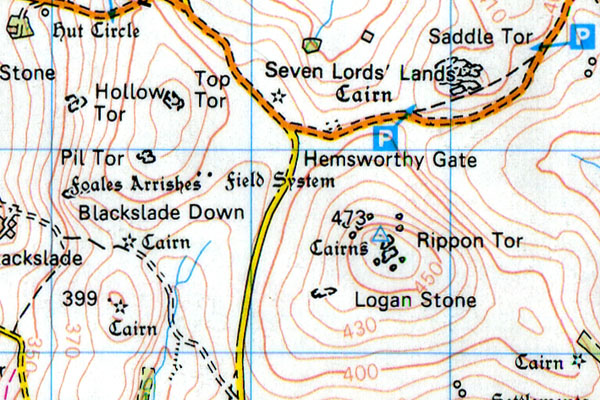
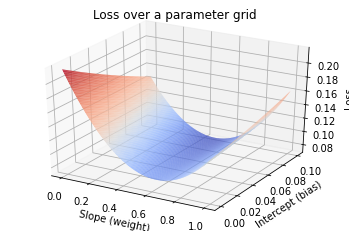
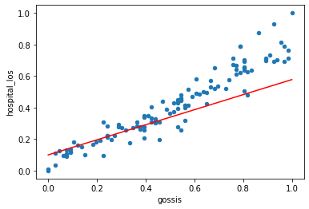

## Optimisation

In the previous section, we looked at how we can define a well fitted model using a loss function. In our case, the loss function is mean squared error:

$$
mse = \frac{1}{n}\sum_{i=1}^{n}(y_{i} - \hat{y}_{i})^{2}
$$

Our goal is to find weights and bias that minimise this loss function. i.e. we want to find the model parameters that give us the smallest mean squared error. Gradient descent is an optimisation algorithm that can help us.

## Gradient descent

Gradient descent is a well-used optimisation algorithm in machine learning. Put simply, gradient descent walks to the bottom of the search space by taking steps in the opposite direction of the gradient (i.e. the algorithm looks for the lowest point by always heading downhill).

Imagine a plot of the loss (z-axis) for a matrix of different parameter values (x-axis and y-axis). This plot would look something like a contour map, with one or more peaks and troughs. The point of smallest loss is the point where our parameters are best. Our goal is to get there. 



You may remember from calculus classes that differentiation is the process that we use to find a gradient. Gradient tells us the rate of change of one variable with respect to another variable (it is, for example, the process that allows us to find velocity when we know position over time). 

When we know the gradient, we can modify our parameters to take a step towards a smaller loss. We need somewhere to start our search, so typically we initialise our parameters randomly or simply give them the value of zero. We then take steps towards smaller and smaller loss.

The size of our steps is also important. Looking at our contour map, you could see how we might step across our lowest point if we took giant steps. Equally, we might take forever to get to the lowest point if our steps are tiny. Our step size is referred to as the *learning rate*.

## Visualising our search space

To help visualise our search task, let's begin by plotting the space that we are searching over. We'll create a matrix of different values for the weights and bias, and then we'll calculate the loss at each of these points.

Let's load our dataset. We will scale our features so that they are in the range of 0-1, which is usually a helpful step when training models. Scaling helps to avoid features of large magnitude from dominating.

```python
import numpy as np
from mpl_toolkits import mplot3d

# Load data
cohort = pd.read_csv('example_los.csv')

# Scale features
df = cohort[['gossis','hospital_los']]
scaled_cohort=(df-df.min())/(df.max()-df.min())
scaled_cohort.head()
```

We'll need our model and loss functions from the previous section:

```python
# predictive model (from previous section)
def model(weight, X, bias):
    """
    Linear regression model: y_hat = wX + b. Takes array of x-values and
    outputs corresponding y-values.
    """
    return np.dot(weight, X) + bias

# loss function (from previous section)
def loss(y, y_hat):
    """
    Loss function (mean squared error)
    """
    return np.mean((y - y_hat)**2)
```

We can now do a grid search, plotting loss across a matrix of weight-bias combinations. We can use our knowledge of the training set to constrain the size of our search grid.

```python
# library for 3d surface plot
from mpl_toolkits import mplot3d

# generate grid of weight and bias
weight_space = np.linspace(0, 1, num=200)
bias_space = np.linspace(0, 0.1, num=200)
xx,yy = np.meshgrid(weight_space, bias_space)

# prediction targets
x_true = cohort.gossis.values.reshape(-1,1)
y_true = cohort.hospital_los.values

# compute MSE for each (b0, b1) point on grid
zz = np.empty([len(weight_space), len(bias_space)])
for n, weight in enumerate(weight_space):
    for m, bias in enumerate(bias_space):
        y_hat = model(weight, x_true, bias)
        zz[m, n] = loss(y_true, y_hat)
```

We now have a grid of loss for different weight-bias values that we can visualise:

```python
import matplotlib.colors as colors

ax = plt.axes(projection='3d')
ax.set_xlabel('Slope (weight)')
ax.set_ylabel('Intercept (bias)')
ax.set_zlabel('Loss', rotation="vertical")
ax.plot_surface(xx, yy, zz, rstride=2, cstride=2, cmap='coolwarm',
                norm=colors.LogNorm(vmin=zz.min(), vmax=zz.max()))
ax.set_title('Loss over a matrix of parameter values');
```

{: width="600px"}

## Approximate parameters

Using our grid search, we can find the approximate parameters that correspond to our minimum loss. 

```python
# zz.min() is the minimum loss
# find the location of the optimal weight and bias using zz.min() as the index
weight = xx[zz == zz.min()]
bias = yy[zz == zz.min()]
```

Let's plot our line of best fit using our newly discovered weight and bias:

```python
# plot scaled training data
ax = cohort.plot(x='gossis', y='hospital_los', kind='scatter')

# plot y_hat for scaled gossis
x_range = [0, 1]
y_hat = model(weight, [x_range], bias)
ax.plot(x_range, y_hat, color='red')
```

{: width="600px"}

Not perfect, but not too far off! A more complete search grid would likely have given us a better fit, but it would computationally infeasible to do a grid search for more complicated models.

This is where gradient descent comes to the rescue. Gradient descent allows us to find the sweet spot in a more efficient way. We won't implement the gradient descent algorithm, but we now understand the concept.

This concludes our exploration of gradient descent. In general, we don't need to implement algorithms like gradient descent ourselves when using machine learning. Popular algorithms like this are available as part of machine learning packages such as TensorFlow and Pytorch.

