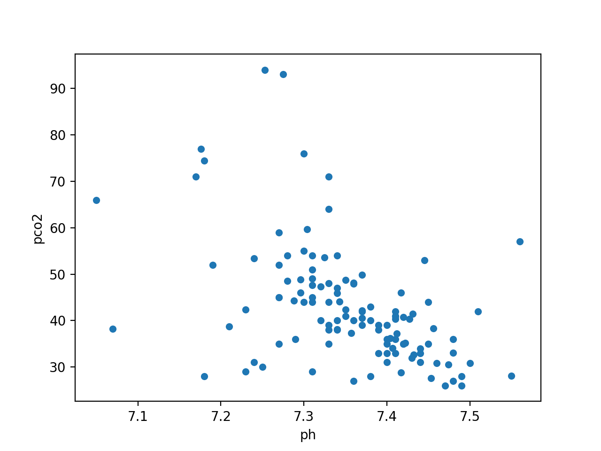
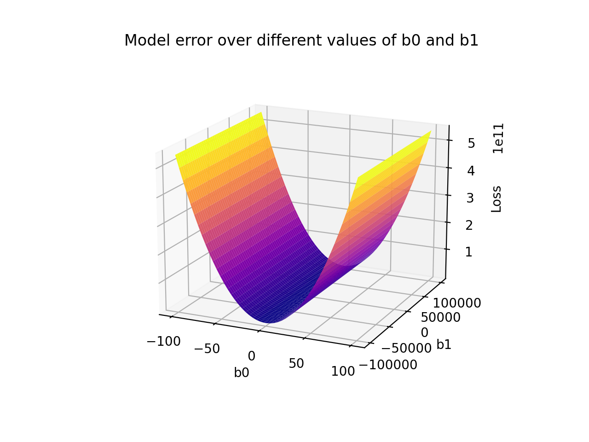

## Optimisation

As a reminder, our goal is to find the line of best fit for our pH and pCO2 data:

{: width="600px"}

We are looking for optimal values for $$\beta_0$$ and $$\beta_1$$ in our linear regression model:

$$
f(x) = \beta_0 + \beta_1 \times x
$$

In the previous section, we looked at how we can define a well fitted model using a loss function (in our case, mean squared error):

$$
mse = \frac{1}{n}\sum_{i=1}^{n}(y_{i} - \hat{y}_{i})^{2}
$$

We plotted the model error for grid of combinations of $$\beta_0$$ and $$\beta_1$$. We now want to find which $$\beta_0$$ and $$\beta_1$$ correspond to the lowest error. Gradient descent is an optimisation algorithm that can help us.

## Gradient descent

Gradient descent is a well-used optimization algorithm in machine learning. Put simply, gradient descent is an algorithm that walks to the bottom of the search space by taking steps in the opposite direction of the gradient (i.e. downhill).

We can find the gradient at any point on a curve by taking the derivative of the function using differentiation. Differentiation is the process of finding the rate of change of a variable with respect to another variable. It is the same process that allows us to find velocity when we know position over time.

[TODO: add steps towards minima.]

{: width="600px"}

## Gradient descent in practice

First, we initialize $$\beta_0$$ and $$\beta_1$$ with random values. For example, $$\beta_0$$ = 1 and $$\beta_1$$ = 2. Our regression formula is now:

$$
f(x) = 1 + 2 \times x
$$

Second, we calculate the partial derivative of our loss function (the MSE) with respect to $$\beta_0$$ and $$\beta_1$$. The formula for the derivatives are:

$$
\frac{\delta mse}{\delta\beta_0} = \frac{2}{n}\sum_{i=1}^{n}-(y_{i} - \hat{y}_{i})^{2}
$$

$$
\frac{\delta{mse}}{\delta\beta_1} = \frac{2}{n}\sum_{i=1}^{n}-{x}_{i}(y_{i} - \hat{y}_{i})^{2}
$$

Third, we plug these values into the following formula to find our improved parameters. $$L$$ is the learning rate, which is the size of our steps. We'll briefly discuss how we select L later.

$$
\beta_0 = \beta_0 - (L \times \delta\beta_0)
$$

$$
\beta_1 = \beta_1 - (L \times \delta\beta_1)
$$

Repeat! When successive iterations cease to decrease the loss function (or only result in very small changes), we have reached the local minima. Our model has "converged".

