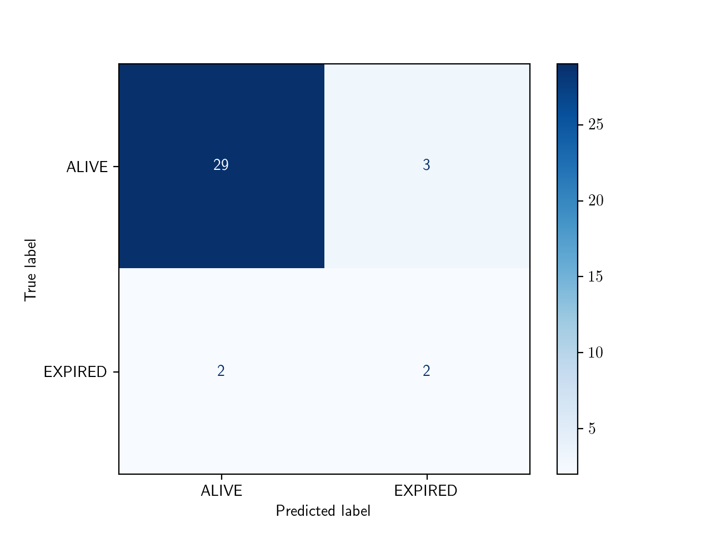
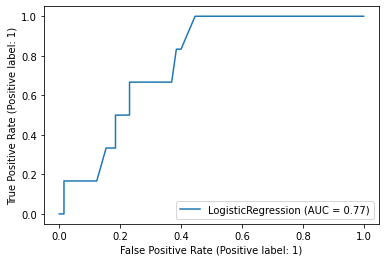

## Evaluating a classification task

We trained a machine learning model to predict the outcome of patients admitted to intensive care units. As there are two outcomes, we refer to this as a "binary" classification task. We are now ready to evaluate the model on our held-out test set. 

```python
from sklearn.linear_model import LogisticRegression
from sklearn.model_selection import train_test_split

# convert outcome to a categorical type
cohort['actualhospitalmortality'] = cohort['actualhospitalmortality'].astype('category')

# add the encoded value to a new column
cohort['actualhospitalmortality_enc'] = cohort['actualhospitalmortality'].cat.codes
cohort[['actualhospitalmortality_enc','actualhospitalmortality']].head()

# define features and outcome
features = ['apachescore']
outcome = ['actualhospitalmortality_enc']

# partition data into training and test sets
X = cohort[features]
y = cohort[outcome]
x_train, x_test, y_train, y_test = train_test_split(X, y, train_size = 0.7, random_state =  42)

# restructure data for input into model
x_train = x_train.values.reshape((len(x_train.values), 1))
y_train = y_train.values.ravel()
x_test = x_test.values.reshape((len(x_test.values), 1))
y_test = y_test.values.ravel()

# train model
reg = LogisticRegression(random_state=0)
reg.fit(x_train, y_train)

# generate predictions
y_hat_test = reg.predict(x_test)
y_hat_test_proba = reg.predict_proba(x_test)
```

Each prediction is assigned a probability of a positive class. For example, the first 10 probabilities are:

```python
probs = y_hat_test_proba[:,1][:12]
rounded_probs = [round(x,2) for x in probs]
print(rounded_probs)
```

```
[0.09, 0.11, 0.23, 0.21, 0.23, 0.21, 0.19, 0.03, 0.2, 0.67, 0.54, 0.72]
```
{: .output}

These probabilities correspond to the following predictions, either a "0" ("ALIVE") or a 1 ("EXPIRED"):

```python
print(y_hat_test[:12])
```

```
[0 0 0 0 0 0 0 0 0 1 1 1]
```
{: .output}

In comparison with the known outcomes, we can put each prediction into one of the following categories:

- True positive: we predict "1" ("EXPIRED") and the true outcome is "1".
- True negative: we predict "0" ("ALIVE") and the true outcome is "0".
- False positive: we predict "1" ("EXPIRED") and the true outcome is "0".
- False negative: we predict "0" ("EXPIRED") and the true outcome is "1".

```python
print(y_test[:12])
```

```
[0 0 0 0 0 0 1 0 0 0 0 0]
```
{: .output}

## Confusion matrices

It is common practice to arrange these outcome categories into a "confusion matrix", which is a grid that records our predictions against the ground truth. For a binary outcome, confusion matrices are organised as follows:

|                        | Positive (actual)   | Negative  (actual)   |
| :---                   |    :----:           |          :----:      |
| Positive (predicted)   | **TP**              | FP                   |
| Negative (predicted)   | FN                  | **TN**               |

The sum of the cells is the total number of predictions. The diagonal from top left to bottom right indicates correct predictions. Let's visualize the results of the model in the form of a confusion matrix:

```python
# import the metrics class
from sklearn import metrics
confusion = metrics.confusion_matrix(y_test, y_hat_test)

class_names=cohort['actualhospitalmortality'].cat.categories
disp = metrics.ConfusionMatrixDisplay.from_estimator(
    reg, x_test, y_test, display_labels=class_names,
    cmap=plt.cm.Blues)

plt.show()
```

{: width="600px"}

We have two columns and rows because we have a binary outcome, but you can also extend the matrix to plot multi-class classification predictions. If we had more output classes, the number of columns and rows would match the number of classes.

## Accuracy

Accuracy is the overall proportion of correct predictions. Think of a dartboard. How many shots did we take? How many did we hit? Divide one by the other and that's the accuracy. 

Accuracy can be written as:

$$
Accuracy = \frac{TP+TN}{TP+TN+FP+FN}
$$

What was the accuracy of our model? 

```python
acc = metrics.accuracy_score(y_test, y_hat_test)
print(f"Accuracy (model) = {acc:.2f}")
```

```
Accuracy (model) = 0.82
```
{: .output}

Not bad at first glance. When comparing our performance to guessing "0" for every patient, however, it seems slightly less impressive!

```python
zeros = np.zeros(len(y_test))
acc = metrics.accuracy_score(y_test, zeros)
print(f"Accuracy (zeros) = {acc:.2f}")
```

```
Accuracy (zeros) = 0.92
```
{: .output}

The problem with accuracy as a metric is that it is heavily influenced by prevalence of the positive outcome: because the proportion of 1s is relatively low, classifying everything as 0 is a safe bet.

We can see that the high accuracy is possible despite totally missing our target. To evaluate an algorithm in a way that prevalence does not cloud our assessment, we often look at sensitivity and specificity. 

## Sensitivity (or "Recall")

Sensitivity is the ability of an algorithm to predict a positive outcome when the actual outcome is positive. In our case, of the patients who die, what proportion did we correctly predict? This can be written as:

$$
Sensitivity = Recall = \frac{TP}{TP+FN}
$$

Because a model that calls "1" for everything has perfect sensitivity, this measure is not enough on its own. Alongside sensitivity we often report on specificity.

## Specificity

Specificity is the ability of a model call a "1" when the case is actually "1". In our case, what proportion of patients who died did we predict would die? The formula for specificity is:

$$
Specificity = \frac{TN}{FP+TN}
$$

## Receiver-Operator Characteristic

A Receiver-Operator Characteristic (ROC) curve plots 1 - specificity vs. sensitivity at varying probability thresholds. The area under this curve is known as the AUROC (or sometimes just the "Area Under the Curve", AUC) and it is a well-used measure of discrimination that was originally developed by radar operators in the 1940s.

```python
metrics.plot_roc_curve(reg, x_test, y_test)
```

An AUROC of 0.5 is terrible and an AUROC of 1.0 is perfect. An AUROC of 0.9 tells us that the 90% of times our model will assign a higher risk to a randomly selected patient with an event than to a randomly selected patient without an event

{: width="600px"}

