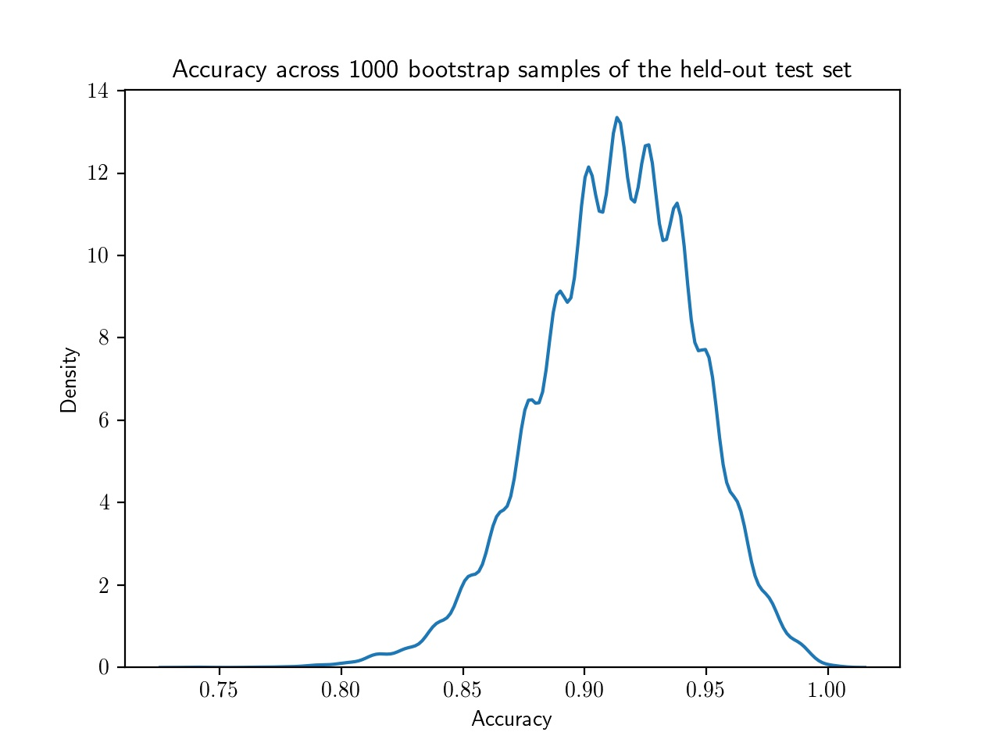
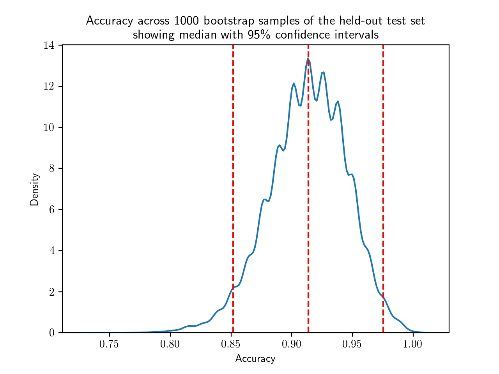



## Bootstrapping

In statistics and machine learning, bootstrapping is a resampling technique that involves repeatedly drawing samples from our source data with replacement, often to estimate a population parameter. By "with replacement", we mean that the same data point may be included in our resampled dataset multiple times.

The term originates from the impossible idea of lifting ourselves up without external help, by pulling on our own bootstraps. Side note, but apparently it's also why we "boot" up a computer (to run software, software must first be run, so we bootstrap).

Typically our source data is only a small sample of the ground truth. Bootstrapping is loosely based on the law of large numbers, which says that with enough data the empirical distribution will be a good approximation of the true distribution.

Using bootstrapping, we can generate a distribution of estimates, rather than a single point estimate. The distribution gives us information about certainty, or the lack of it.

Let's see how we can use bootstrapping to calculate a confidence interval when evaluating the accuracy of a model on a held-out test set. Steps: 

1. Draw a sample of size N from the original dataset with replacement. This is a bootstrap sample.
2. Repeat step 1 S times, so that we have S bootstrap samples.
3. Estimate our value on each of the bootstrap samples, so that we have S estimates
4. Use the distribution of estimates for inference (for example, estimating the confidence intervals).

```python
import matplotlib.pyplot as plt
from sklearn.linear_model import LogisticRegression
from sklearn.model_selection import train_test_split
from sklearn.utils import resample
from sklearn.metrics import accuracy_score

# convert outcome to a categorical type
cohort['actualhospitalmortality'] = cohort['actualhospitalmortality'].astype('category')

# add the encoded value to a new column
cohort['actualhospitalmortality_enc'] = cohort['actualhospitalmortality'].cat.codes
cohort[['actualhospitalmortality_enc','actualhospitalmortality']].head()

# define features and outcome
features = ['apachescore']
outcome = ['actualhospitalmortality_enc']

# partition data into training and test sets
X = cohort[features]
y = cohort[outcome]
x_train, x_test, y_train, y_test = train_test_split(X, y, train_size = 0.7, random_state =  42)

# restructure data for input into model
x_train = x_train.values.reshape((len(x_train.values), 1))
y_train = y_train.values.ravel()
x_test = x_test.values.reshape((len(x_test.values), 1))
y_test = y_test.values.ravel()

# train model
reg = LogisticRegression(random_state=0)
reg.fit(x_train, y_train)

# bootstrap predictions
accuracy = []
n_iterations = 1000
for i in range(n_iterations):
    X_bs, y_bs = resample(x_train, y_train, replace=True)
    # make predictions
    y_hat = reg.predict(X_bs)
    # evaluate model
    score = accuracy_score(y_bs, y_hat)
    accuracy.append(score)
```

Let's plot a distribution of accuracy values computed on the bootstrap samples.

```python
import seaborn as sns
# plot distribution of accuracy
sns.kdeplot(accuracy)
plt.title("Accuracy across 1000 bootstrap samples of the held-out test set")
plt.xlabel("Accuracy")
plt.show()
```

{: width="600px"}

We can now take the mean accuracy across the bootstrap samples, and compute confidence intervals. There are several different approaches to computing the confidence interval. We will use the percentile method, a simpler approach that does not require our sampling distribution to be normally distributed.

## Percentile method

For a 95% confidence interval we can find the middle 95% bootstrap statistics. This is known as the percentile method. This is the preferred method because it works regardless of the shape of the sampling distribution.  

Regardless of the shape of the bootstrap sampling distribution, we can use the percentile method to construct a confidence interval. Using this method, the 95% confidence interval is the range of points that cover the middle 95% of bootstrap sampling distribution.

We determine the mean of each sample, call it X̄ , and create the sampling distribution of the mean. We then take the α/2 and 1 - α/2 percentiles (e.g. the .025*1000 and .975*1000 = 25th and 975th bootstrapped statistic), and these are the confidence limits.

```python
# get median
median = np.percentile(accuracy, 50)

# get 95% interval
alpha = 100-95
lower_ci = np.percentile(accuracy, alpha/2)
upper_ci = np.percentile(accuracy, 100-alpha/2)

print(f"Model accuracy is reported on the test set. 1000 bootstrapped samples " 
      f"were used to calculate 95% confidence intervals.\n"
      f"Median accuracy is {median:.2f} with a 95% a confidence "
      f"interval of [{lower_ci:.2f},{upper_ci:.2f}].")
```

```
Model accuracy is reported on the test set. 1000 bootstrapped samples were used to calculate 95% confidence intervals.
Median accuracy is 0.91 with a 95% a confidence interval of [0.85,0.98].
```
{: .output}


```python
sns.kdeplot(accuracy)
plt.title("Accuracy across 1000 bootstrap samples of the held-out test set\n"
          "showing median with 95\\% confidence intervals")
plt.xlabel("Accuracy")
plt.axvline(median,0, 14, linestyle="--", color="red")
plt.axvline(lower_ci,0, 14, linestyle="--", color="red")
plt.axvline(upper_ci,0, 14, linestyle="--", color="red")
plt.show()
```

{: width="600px"}

Once an interval is calculated, it may or may not contain the true value of the unknown parameter. A 95% confidence level does \*not\* mean that there is a 95% probability that the population parameter lies within the interval.

The confidence interval tells us about the reliability of the estimation procedure. 95% of confidence intervals computed at the 95% confidence level contain the true value of the parameter.
